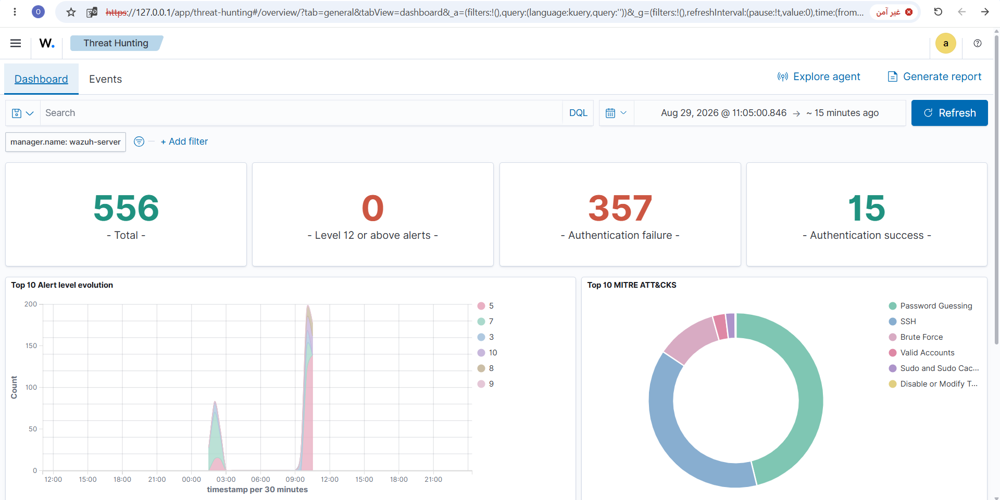
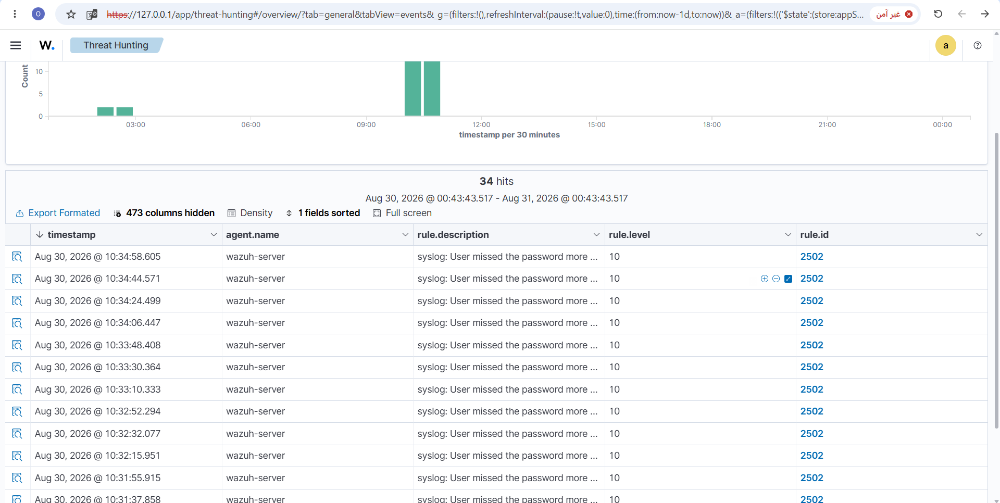
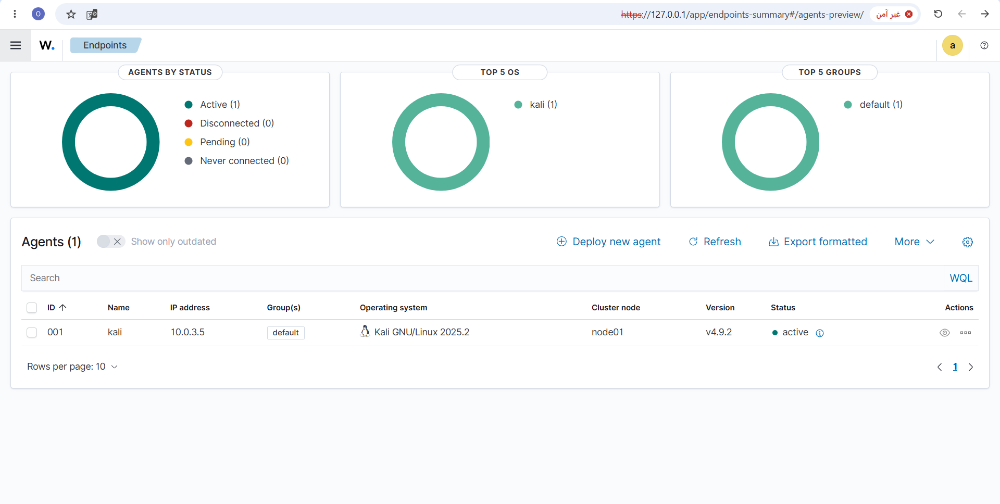
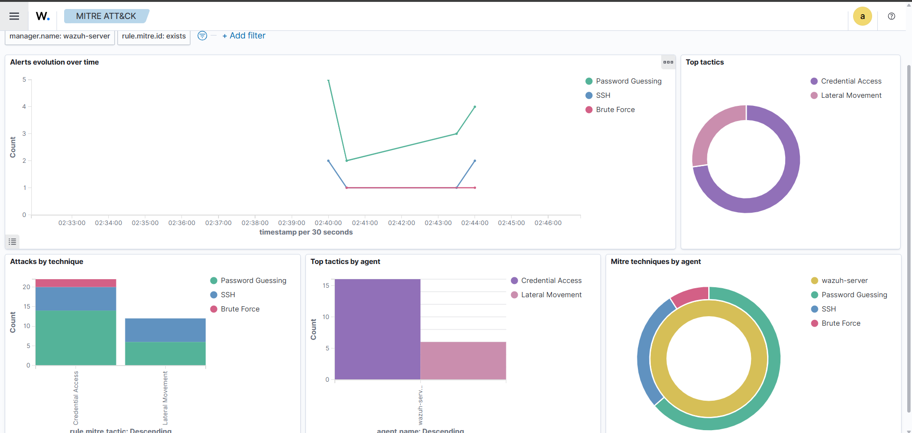

# SOC Home Lab: Detecting SSH Brute Force with Wazuh

## 📌 Overview
This project demonstrates a complete Security Operations Center (SOC) analysis workflow. I built a homelab environment to simulate a real-world SSH brute-force attack, collected the logs, ingested them into a SIEM (Wazuh), identified the Indicators of Compromise (IOCs), and documented the incident as a SOC Analyst would.

## 🛠️ Tools Used
- *VirtualBox* (Hypervisor)
- *Ubuntu Server 26.04* (Wazuh Server - Manager, Indexer, Dashboard)
- *Kali Linux* (Attacker Machine)
- *Wazuh 4.9.2* (SIEM/XDR)
- *Hydra* (Brute-Force Tool)

## 🚀 Architecture & Network
- *Wazuh Server:* Collects, indexes, and analyzes security logs.
- *Kali Agent:* Generates malicious traffic.
- *Network:* NAT Network (Isolated Lab Environment) with IP 10.0.3.4 (Server) and 10.0.3.5 (Attacker).

## ⚔️ Attack Scenario & Detection
1. I used the *Hydra* tool on Kali Linux to launch a brute-force attack against the SSH service on the Wazuh server.
2. The Wazuh Agent on the server detected the failed authentication attempts.
3. The Wazuh Manager analyzed these logs and raised alerts based on Rule ID *2502* (User missed the password more than one time) and *5710* (SSH Attempt to login using a non-existent user).

## 📊 Analysis & Results
- *Alert Level:* *10* (Critical)
- *Rule ID:* *2502* / *5710*
- *Type:* *True Positive* (Confirmed attack)
- *Source IP (IOC):* 10.0.3.5
- *Victim IP:* 10.0.3.4
- *Attack Technique:* *T1110: Brute Force* (Credential Access)

## 🎯 MITRE ATT&CK Mapping
- *Tactic:* Credential Access
- *Technique:* T1110 - Brute Force
- *Sub-technique:* T1110.001 - Password Guessing

## 🛡️ Recommendations (Mitigation)
- Disable root login over SSH (PermitRootLogin no).
- Implement SSH key-based authentication instead of passwords.
- Deploy Fail2Ban to automatically block IPs with repeated failures.
- Restrict SSH access using a firewall (UFW) / VPN.
- Enforce strong password policy and MFA.

## 💡 Conclusion
This project proves the ability to build a working SIEM environment, launch a realistic attack, correlate suspicious logs, and document the findings using industry-standard frameworks (MITRE ATT&CK).

## 📷 Screenshots

  